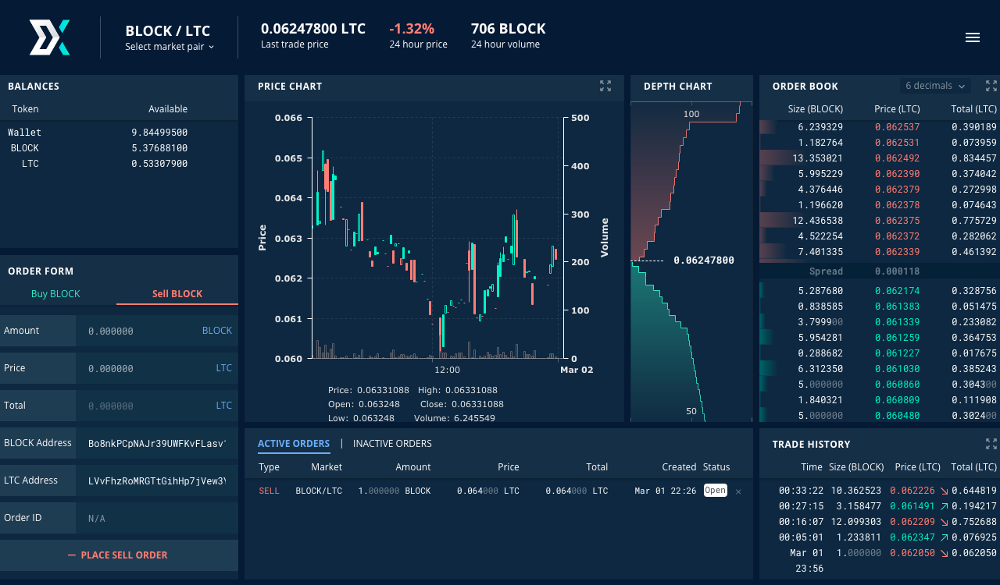

title: Block DX Setup Guide
description: This guide explains how to setup Block DX for secure trading. Block DX is the fastest, most secure, most reliable, and most decentralized exchange (DEX).

# Block DX Setup

[Block DX](introduction.md) is the fastest, most secure, most reliable, and most decentralized exchange. With a user-friendly UI, peer-to-peer trading is made as simple as using a centralized exchange. The following guides will take you through each step, start to finish, so you can begin trading securely.

> [**Watch Video Tutorial**](https://www.youtube.com/watch?v=aFSl60KcaCk)

## Setup
1. [Install the Blocknet wallet](../wallet/setup.md). The Blocknet wallet is required to
   facilitate peer-to-peer trading on Block DX.
1. Since Block DX is non-custodial, you'll need to store the
   [digital assets](../resources/glossary.md#digital-asset) you want to
   trade in your own wallet. One convenient option is to store them in your own [XLite wallet](../xlite/setup.md), a
   noncustodial, lightweight, decentralized, multi-asset wallet
   powered by Blocknet. However, if XLite doesn't support the assets you
   want to trade, or if you simply prefer not to use XLite for some
   assets, then you'll need to install the native wallets of those assets.
    * Note: These native wallets are the native Qt/cli wallets released by each asset's respective project, which you may already have installed. Block DX does not generate wallets for you.
	* [View compatible digital assets and wallet versions](listings.md#listed-digital-assets)
1. [Install Block DX](installation.md). This is a desktop dApp and not supported in-browser.
1. [Complete the configuration wizard](configuration.md).
1. [Begin secure trading](trading.md)!

--8<-- "troubleshooting.md"

--8<-- "extras.md"

